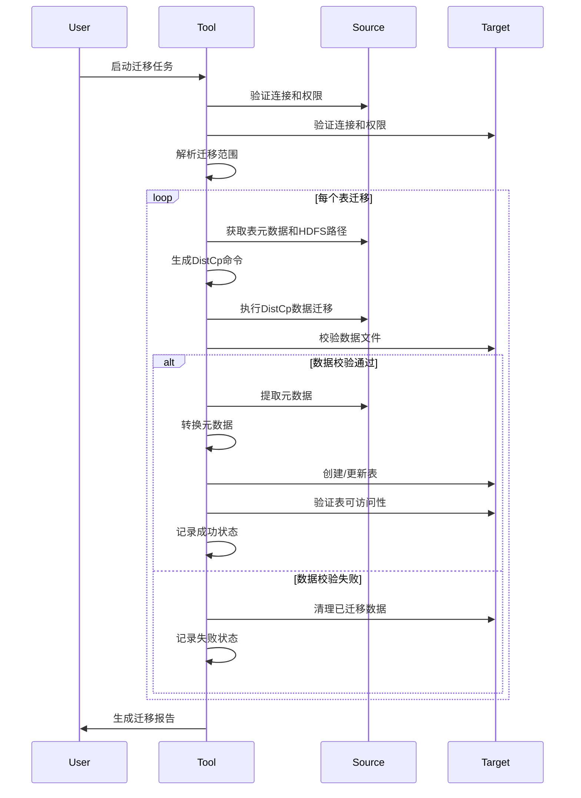

# CLAUDE.md

This file provides guidance to Claude Code (claude.ai/code) when working with code in this repository.

# Hadoop Cluster Data Migration Tool (CDH → MRS)

## Project Overview

A lightweight tool for migrating data from **CDH 7.1.9** (Hive 2.1.1) to **Huawei MRS 3.5.0** (Hive 3.1.0). Migrates Parquet data files and Hive metadata. Target scale: hundreds of TB.

## Architecture

```
Windows PC → Java Migration Tool → CDH Client / MRS Client
                                        ↓              ↓
                                   CDH Cluster    MRS Cluster
                                   HDFS/Hive/HMS  HDFS/Hive/HMS
```

**Core Modules:**
- `DistCpExecutor` - Wraps Hadoop DistCp for data migration
- `HiveMetadataExtractor/Importer` - Extracts and imports Hive table metadata
- `MigrationStateManager` - Tracks migration status per table (PENDING → DATA_COPYING → DATA_COPIED → METADATA_MIGRATING → COMPLETED/FAILED)
- `ConfigManager` - YAML-based configuration for clusters and tasks

## Key Design Decisions

### Migration Atomicity
- **Atomic unit**: Table (data + metadata)
- Either entire table migrates successfully or fully rolls back
- State persistence enables resume after interruption

### Hive Version Compatibility (2.1.1 → 3.1.0)
| Issue | Solution |
|-------|----------|
| HDFS paths | Rewrite `hdfs://cdh-nn:8020/` → `hdfs://mrs-nn:8020/` |
| Bucketing version | Version 1 → 2 |
| Transactional property | Add `transactional=false` explicitly |
| Statistics | Clear old stats (recollect on target) |
| UNIONTYPE columns | Flag for manual conversion |

### Additional Compatibility Issues (Often Missing)
| Issue | Impact | Solution |
|-------|--------|----------|
| **Views** | Cannot migrate views directly | Recreate view DDL manually, or skip with warning |
| **UDFs** | Custom functions not in HMS | Document required UDFs separately |
| **SerDe class names** | CDH vs MRS Parquet SerDe may differ | Use MRS-native SerDe class |
| **Database properties** | Description, owner, location | Migrate with table metadata |
| **Column/table comments** | May be lost | Preserve via TBLPROPERTIES |
| **EXTERNAL vs MANAGED_TABLE** | Data location handling differs | See table type handling below |

### Table Type Handling
| CDH Table Type | Data Location | Migration Strategy |
|----------------|---------------|-------------------|
| **EXTERNAL_TABLE** | User-specified path | Copy data to new target path, rewrite location |
| **MANAGED_TABLE** | Hive warehouse dir | Copy data to new warehouse path, preserve managed semantics |

### Kerberos Authentication Support
```yaml
clusters:
  source:
    kerberos:
      enabled: true
      principal: "hadoop@REALM"
      keytabPath: "/path/to/keytab"
      krb5Conf: "/path/to/krb5.conf"
  target:
    kerberos:
      enabled: true
      # ... same structure
```

### Windows Environment Note
Running on Windows PC requires one of:
- **WSL (Windows Subsystem for Linux)** - recommended
- **Git Bash with Hadoop CLI** - partial support
- **Cygwin** - not tested

Environment variables use bash syntax; on Windows use `set HADOOP_HOME_CDH=...` in cmd or export in bash.

### DistCp Cross-Cluster Strategy
DistCp does NOT support direct cross-cluster copy. Choose one approach:

**Option A: WebHDFS/HFTP Protocol (read from source, write to target)**
```java
// Source accessed via hftp (read-only), target via WebHDFS
sourcePath = "hftp://cdh-nn:50070/source/path"  // or webhdfs://cdh-nn:50070
targetPath = "webhdfs://mrs-nn:9870/target/path"
```

**Option B: Through MRS HDFS API (requires WebHDFS enabled on MRS)**
```java
// Both source and target use WebHDFS
sourcePath = "webhdfs://cdh-nn:50070/source/path"
targetPath = "webhdfs://mrs-nn:9870/target/path"
```

**Critical**: Both clusters must have WebHDFS/REST API enabled. MRS usually has this enabled by default.

### DistCp Parameters
```java
"-skipcrccheck", "-p", "-update", "-strategy", "dynamic", "-m", "20"
```

### DistCp Atomicity Note
DistCp is **NOT atomic**. If interrupted at 90%, partial data remains on target.
**Cleanup required**: Track copied files and delete on failure, or use `-delete` to sync exactly.

### Source Data Change Protection
Static migration requires source data immutability during migration. Options:
1. **HDFS Snapshots** (if CDH supports): `hdfs dfs -createSnapshot /path snapshot_name`
2. **Read-only flag**: Set `readOnly=true` table property before migration
3. **Accept eventual consistency**: Re-verify after migration, accept minor discrepancies

## Configuration (`config.yaml`)

```yaml
clusters:
  source:
    name: "cdh-cluster"
    type: "CDH"
    version: "7.1.9"
    hiveVersion: "2.1.1"
    configDir: "/path/to/cdh/client/conf"
  target:
    name: "mrs-cluster"
    type: "MRS"
    version: "3.5.0"
    hiveVersion: "3.1.0"
    configDir: "/path/to/mrs/client/conf"

migration:
  tasks:
    - database: "sales_db"
      tables: ["orders", "customers"]
  distcp:
    mapTasks: 20
    bandwidthMB: 100
    retryCount: 3
```

## Planned Directory Structure

```
hadoop-migration-tool/
├── bin/migration-tool.bat
├── conf/config.yaml
├── lib/*.jar
├── logs/
└── state/
```

## Environment Variables Required

```bash
HADOOP_HOME_CDH=/path/to/cdh/hadoop
HADOOP_HOME_MRS=/path/to/mrs/hadoop
HIVE_HOME_CDH=/path/to/cdh/hive
HIVE_HOME_MRS=/path/to/mrs/hive
```

## Migration Workflow

1. Validate connections to both clusters
2. Parse migration tasks from config
3. For each table:
   - Extract metadata from CDH HMS
   - Execute DistCp for data files
   - Verify data (file count, size)
   - Transform metadata for Hive 3.x compatibility
   - Create table in MRS
   - Verify table accessibility
4. Generate migration report

## Status Enum

```java
PENDING → DATA_COPYING → DATA_COPIED → METADATA_MIGRATING → COMPLETED
                                                    → FAILED → ROLLBACK
```

## Report Output Format

```json
{
  "migrationSummary": {
    "totalTables": 150,
    "successfulTables": 148,
    "failedTables": 2,
    "totalDataSize": "345.2 TB"
  },
  "failedTables": [...],
  "compatibilityIssues": {...}
}
```

---

# 轻量级Hadoop集群数据迁移工具设计文档

## 1. 概述

### 1.1 项目背景
本项目旨在开发一个轻量级工具，用于将数据从CDH 7.1.9集群迁移至华为MRS 3.5.0集群。迁移范围包括Parquet格式数据文件及相关Hive元数据，目标数据规模为几百TB级别。

### 1.2 设计目标
- **轻量高效**：基于现有Hadoop生态工具，避免重复造轮子
- **可靠准确**：确保数据迁移的完整性和一致性
- **操作简便**：提供清晰的配置和操作界面
- **版本兼容**：自动处理Hive 2.x到3.x的元数据兼容性问题

### 1.3 约束条件
- 源集群：CDH 7.1.9 (Hive 2.1.1)
- 目标集群：华为MRS 3.5.0 (Hive 3.1.0)
- 迁移类型：静态迁移（迁移期间源数据不变化）
- 运行环境：Windows PC（需WSL/Git Bash），可同时访问两个集群内网
- 认证方式：集群间互信，网络打通，工具通过客户端访问
- **前置条件**：CDH和MRS集群必须开启WebHDFS/REST API
- **网络要求**：
  - 内网连接：CDH集群内网 + MRS集群内网（通常不可直接互通）
  - 方案1：通过堡垒机/跳板机跳转
  - 方案2：使用VPN打通两个集群的内网
  - 方案3：MRS为公网访问版本（如MRS云服务）

## 2. 系统架构

### 2.1 整体架构
```
┌─────────────────────────────────────────────────────┐
│                 Windows PC运行环境                   │
├─────────────────────────────────────────────────────┤
│   迁移工具 (Java Application)                        │
│  ┌─────────────┐ ┌─────────────┐ ┌─────────────┐    │
│  │  配置管理   │ │  任务调度   │ │  监控报告   │    │
│  └─────────────┘ └─────────────┘ └─────────────┘    │
│          │               │               │          │
│  ┌───────▼───────────────▼───────────────▼──────┐   │
│  │             核心迁移引擎                      │   │
│  │  ┌─────────────────────────────────────┐    │   │
│  │  │ 1. 数据迁移模块 (DistCp封装)         │    │   │
│  │  │ 2. 元数据迁移模块 (HMS Client)       │    │   │
│  │  │ 3. 校验与回滚模块                    │    │   │
│  │  └─────────────────────────────────────┘    │   │
│  └──────────────────────────────────────────────┘   │
├─────────────────────────────────────────────────────┤
│   集群客户端配置                                    │
│  ┌──────────────┐         ┌──────────────┐         │
│  │ CDH 7.1.9    │         │ MRS 3.5.0    │         │
│  │ 客户端配置   │         │ 客户端配置   │         │
│  └──────────────┘         └──────────────┘         │
└─────────────────────────────────────────────────────┘
         │                           │
         ▼                           ▼
┌──────────────┐           ┌──────────────┐
│  CDH集群      │           │  MRS集群      │
│  • HDFS      │           │  • HDFS      │
│  • Hive      │           │  • Hive      │
│  • HMS       │           │  • HMS       │
└──────────────┘           └──────────────┘
```

### 2.2 组件说明
1. **配置管理模块**：管理源和目标集群的连接配置、迁移任务配置
2. **任务调度模块**：控制迁移任务的执行顺序和并发度
3. **核心迁移引擎**：执行实际的数据和元数据迁移
4. **监控报告模块**：收集迁移状态、生成报告和告警
5. **校验与回滚模块**：验证迁移结果，必要时执行回滚操作

## 3. 详细设计

### 3.1 数据迁移模块

#### 3.1.1 DistCp跨集群方案
**注意**：标准DistCp不支持直接跨集群复制，需要通过协议实现：

```java
public class DistCpExecutor {
    // 方案A：通过 hftp 协议读取源（只读），WebHDFS 写入目标
    // 源：hftp://cdh-nn:50070/source/path
    // 目标：webhdfs://mrs-nn:9870/target/path

    // 方案B：两个集群都通过 WebHDFS
    // 源：webhdfs://cdh-nn:50070/source/path
    // 目标：webhdfs://mrs-nn:9870/target/path

    // 核心DistCp参数配置
    private static final String[] BASE_DISTCP_PARAMS = {
        "-skipcrccheck",      // 跳过CRC检查（跨集群必需）
        "-p",                // 保留状态（权限、时间戳等）
        "-update",           // 覆盖已存在的文件
        "-strategy", "dynamic", // 使用动态策略
        "-m", "20"           // 设置20个map任务（可配置）
    };

    // 原子性保证：DistCp不是原子操作，需要手动清理
    // 如果复制中断，目标端会残留部分数据，需要Track并Delete
}
```

**前置条件**：CDH和MRS集群都必须开启WebHDFS/REST API。

#### 3.1.2 数据校验策略
1. **文件级校验**：比较源和目标文件的文件数量、总大小
2. **目录结构校验**：验证目录树结构一致性
3. **可选校验**：抽样文件内容校验（性能与准确性平衡）

#### 3.1.3 源数据变更防护（静态迁移保证）
迁移期间源数据必须保持不变，可选方案：

| 方案 | 适用场景 | 实现方式 |
|------|---------|---------|
| HDFS快照 | CDH支持快照功能 | `hdfs dfs -createSnapshot /path snapshot_name` |
| 只读标记 | 设置表属性 | `ALTER TABLE t SET TBLPROPERTIES ('readOnly'='true')` |
| 接受最终一致性 | 允许微小差异 | 迁移后重新校验 |

**推荐**：优先使用HDFS快照，迁移完成后删除快照。

### 3.2 元数据迁移模块

#### 3.2.1 元数据提取
```java
public class HiveMetadataExtractor {
    private HiveMetaStoreClient sourceClient;
    private HiveMetaStoreClient targetClient;
    
    public TableMetadata extractTableMetadata(String dbName, String tableName) {
        Table sourceTable = sourceClient.getTable(dbName, tableName);
        
        // 转换为中间表示，便于转换处理
        TableMetadata metadata = convertToMetadata(sourceTable);
        
        // 应用兼容性转换规则
        applyCompatibilityRules(metadata);
        
        return metadata;
    }
}
```

#### 3.2.2 Hive版本兼容性转换规则

| 转换项 | CDH 7.1.9 (Hive 2.1.1) | MRS 3.5.0 (Hive 3.1.0) | 转换规则 |
|--------|------------------------|------------------------|----------|
| 表类型 | MANAGED_TABLE/EXTERNAL_TABLE | 相同 | 直接映射 |
| 存储格式 | Parquet | Parquet | 使用MRS原生SerDe类 |
| 事务属性 | 非ACID表无属性 | 需要显式设置 | 添加`'transactional'='false'` |
| 路径引用 | hdfs://cdh-nn:8020/path | hdfs://mrs-nn:8020/path | 路径重写 |
| 统计信息 | 保留但重新计算 | 重新收集 | 移除旧统计信息 |
| Bucketing版本 | 1 | 2 | 升级bucketing版本 |

#### 3.2.3 补充兼容性处理项

| 处理项 | CDH Hive 2.1.1 | MRS Hive 3.1.0 | 处理策略 |
|--------|-----------------|-----------------|---------|
| **视图 (View)** | 支持 | 支持 | 无法直接迁移，需记录DDL手动重建或跳过并告警 |
| **自定义函数 (UDF)** | 自定义Jar | 不自动迁移 | 单独记录所需UDF，手动部署到MRS |
| **SerDe类名** | `org.apache.hadoop.hive.ql.io.parquet.serde.ParquetHiveSerDe` | MRS实现可能不同 | 使用MRS兼容的SerDe类 |
| **数据库属性** | description, owner等 | 相同 | 随表元数据一起迁移 |
| **列/表注释** | 支持 | 支持 | 通过TBLPROPERTIES保留 |
| **EXTERNAL_TABLE** | 用户指定路径 | 用户指定路径 | 复制数据到新路径，重写location |
| **MANAGED_TABLE** | Hive warehouse目录 | Hive warehouse目录 | 复制数据到新warehouse路径 |

#### 3.2.3 元数据导入
```java
public class HiveMetadataImporter {
    public ImportResult importMetadata(TableMetadata metadata, String targetLocation) {
        // 1. 创建目标数据库（如不存在）
        ensureDatabaseExists(metadata.getDbName());
        
        // 2. 重写HDFS路径
        metadata.setLocation(rewriteHdfsPath(
            metadata.getLocation(), 
            targetLocation
        ));
        
        // 3. 创建表
        Table targetTable = buildTargetTable(metadata);
        
        try {
            targetClient.createTable(targetTable);
            return ImportResult.success();
        } catch (AlreadyExistsException e) {
            // 处理表已存在情况
            return handleExistingTable(metadata, targetTable);
        }
    }
}
```

### 3.3 原子性与事务管理

#### 3.3.1 迁移单元定义
以"表"为原子迁移单元，确保：
1. 要么整个表迁移成功（数据+元数据）
2. 要么完全回滚，目标集群不残留部分数据

#### 3.3.2 状态管理机制
```java
public class MigrationStateManager {
    private Map<String, MigrationStatus> statusMap;
    
    public enum MigrationStatus {
        PENDING,           // 等待迁移
        DATA_COPYING,      // 数据拷贝中
        DATA_COPIED,       // 数据拷贝完成
        METADATA_MIGRATING, // 元数据迁移中
        COMPLETED,         // 迁移完成
        FAILED,            // 迁移失败
        ROLLBACK           // 回滚中
    }
    
    public void transition(String tableId, MigrationStatus newStatus) {
        // 状态转换逻辑，确保合法状态流转
        validateTransition(tableId, newStatus);
        statusMap.put(tableId, newStatus);
        persistState(); // 持久化状态，支持断点续传
    }
}
```

### 3.4 配置管理设计

#### 3.4.1 配置文件结构
```yaml
# config.yaml
clusters:
  source:
    name: "cdh-cluster"
    type: "CDH"
    version: "7.1.9"
    hiveVersion: "2.1.1"
    configDir: "/path/to/cdh/client/conf"
    # Kerberos认证配置
    kerberos:
      enabled: true
      principal: "hadoop@REALM"
      keytabPath: "/path/to/keytab"
      krb5Conf: "/path/to/krb5.conf"

  target:
    name: "mrs-cluster"
    type: "MRS"
    version: "3.5.0"
    hiveVersion: "3.1.0"
    configDir: "/path/to/mrs/client/conf"
    kerberos:
      enabled: true
      # ...

migration:
  # 迁移任务配置
  tasks:
    - database: "sales_db"
      tables: ["orders", "customers"]
      includePattern: "*.parquet"

    - database: "web_db"
      tables: ["all"]  # 迁移所有表

  # 执行参数
  distcp:
    mapTasks: 20
    bandwidthMB: 100
    retryCount: 3
    # 跨集群协议：hftp 或 webhdfs
    sourceProtocol: "webhdfs"
    targetProtocol: "webhdfs"

  # 元数据转换规则
  metadata:
    autoConvert: true
    skipUnsupportedProperties: true
    rewriteLocations: true
    # 是否迁移视图（默认跳过）
    migrateViews: false
    warnOnView: true

  # 源数据保护
  sourceProtection:
    method: "snapshot"  # snapshot | readOnly | none
    snapshotPath: "/tmp/migration_snapshots"
```

## 4. 执行流程

### 4.1 完整迁移流程


### 4.2 错误处理与回滚流程
1. **数据迁移失败**：清理目标集群已复制的部分数据
2. **元数据迁移失败**：删除已创建的表定义，保留数据供手动恢复
3. **网络中断**：支持断点续传，基于状态管理恢复
4. **版本不兼容**：记录不兼容项，跳过或按规则处理

## 5. 部署与运行

### 5.1 环境准备
```bash
# 1. 安装Java 8/11

# 2. Windows环境：安装WSL (Windows Subsystem for Linux) 或 Git Bash
# 推荐使用WSL，可完整支持bash脚本
wsl --install -d Ubuntu

# 3. 下载并配置CDH客户端
# 4. 下载并配置MRS客户端
# 5. 设置环境变量（在WSL/Git Bash中）
export HADOOP_HOME_CDH=/path/to/cdh/hadoop
export HADOOP_HOME_MRS=/path/to/mrs/hadoop
export HIVE_HOME_CDH=/path/to/cdh/hive
export HIVE_HOME_MRS=/path/to/mrs/hive

# 6. 验证集群连通性（通过WebHDFS）
curl -s -I "http://cdh-nn:50070/webhdfs/v1/?op=LISTSTATUS"
curl -s -I "http://mrs-nn:9870/webhdfs/v1/?op=LISTSTATUS"

# 7. 验证Kerberos认证（如果启用）
kinit -kt /path/to/keytab hadoop@REALM
klist

# 8. 验证DistCp可用性
$HADOOP_HOME_CDH/bin/hadoop distcp -help
```

### 5.2 工具部署
```bash
# 目录结构
hadoop-migration-tool/
├── bin/
│   ├── migration-tool.sh       # Linux/WSL启动脚本
│   └── migration-tool.bat      # Windows CMD启动脚本
├── conf/
│   ├── config.yaml             # 主配置文件
│   ├── cdh-client-conf/        # CDH客户端配置
│   │   ├── core-site.xml
│   │   ├── hdfs-site.xml
│   │   └── hive-site.xml
│   ├── mrs-client-conf/        # MRS客户端配置
│   └── kerberos/
│       ├── krb5.conf           # Kerberos配置文件
│       └── keytabs/            # Keytab文件目录（不提交到版本控制）
├── lib/
│   └── *.jar                   # 依赖库
├── logs/                       # 日志目录
└── state/                      # 状态持久化目录
```

**安全注意**：keytab文件包含敏感凭证，务必添加到`.gitignore`，不要提交到版本控制系统。

### 5.3 运行示例
```bash
# 1. 编辑配置文件
# 修改 conf/config.yaml 中的集群配置和迁移任务

# 2. 执行迁移
bin\migration-tool.bat --config conf\config.yaml

# 3. 查看进度和日志
# 日志位于 logs/migration_YYYYMMDD_HHMMSS.log

# 4. 生成报告
# 报告位于 reports/migration_report_YYYYMMDD_HHMMSS.html
```

## 6. 监控与验证

### 6.1 迁移进度监控
- 实时显示当前迁移表、进度百分比
- 预计剩余时间估算
- 数据传输速率统计

### 6.2 迁移后验证
1. **数据验证**：抽样查询对比
2. **元数据验证**：表结构一致性检查
3. **功能验证**：简单查询测试
4. **性能基准**：关键查询性能对比

### 6.3 报告生成
```json
{
  "migrationSummary": {
    "totalTables": 150,
    "successfulTables": 148,
    "failedTables": 2,
    "totalDataSize": "345.2 TB",
    "totalTime": "12h 34m",
    "averageSpeed": "7.8 GB/min"
  },
  "failedTables": [
    {
      "database": "sales_db",
      "table": "audit_logs",
      "error": "Unsupported column type: UNIONTYPE",
      "suggestion": "Manual conversion required"
    }
  ],
  "compatibilityIssues": {
    "autoResolved": 45,
    "requiresAttention": 3
  }
}
```

## 7. 风险与缓解措施

### 7.1 技术风险
| 风险 | 概率 | 影响 | 缓解措施 |
|------|------|------|----------|
| Hive版本不兼容 | 中 | 高 | 预定义转换规则，提供手动覆盖选项 |
| DistCp传输中断 | 中 | 中 | 实现断点续传，增加重试机制 |
| DistCp非原子性 | 中 | 中 | 跟踪已复制文件，中断时清理残留数据 |
| 元数据损坏 | 低 | 高 | 迁移前备份源元数据 |
| 磁盘空间不足 | 中 | 高 | 预检查目标集群空间，增量迁移 |
| WebHDFS未开启 | 中 | 高 | 迁移前验证集群WebHDFS可用性 |
| Kerberos认证失败 | 高 | 高 | 预验证Kerberos票据，配置keytab自动续期 |
| 源数据在迁移期间变更 | 高 | 中 | 使用HDFS快照或只读标记 |

### 7.2 操作风险
1. **源数据变更**：确保迁移期间源目录锁定
2. **权限问题**：提前验证目标集群写权限
3. **网络不稳定**：配置合适的超时和重试参数

## 8. 扩展性考虑

### 8.1 未来扩展
1. **支持增量迁移**：基于时间戳或HDFS快照
2. **更多数据格式**：ORC、Avro等格式支持
3. **云迁移支持**：迁移到云上Hadoop服务
4. **性能优化**：并行迁移优化，压缩传输

### 8.2 插件化架构
```java
public interface MigrationPlugin {
    // 数据迁移插件接口
    DataMigrationResult migrateData(MigrationContext context);
    
    // 元数据转换插件接口
    MetadataTransformResult transformMetadata(TableMetadata metadata);
}
```

## 9. 测试策略

### 9.1 测试环境
- 单元测试：Mock集群环境
- 集成测试：小型测试集群
- 预生产验证：与生产环境相似的测试集群

### 9.2 测试用例
1. **功能测试**：单个表迁移、批量表迁移
2. **异常测试**：网络中断、权限不足、空间不足
3. **性能测试**：大数据量迁移、并发迁移
4. **兼容性测试**：各种Hive表类型和特性

---

## 附录A：Hive版本兼容性矩阵

| 特性 | Hive 2.1.1 | Hive 3.1.0 | 迁移处理策略 |
|------|------------|------------|--------------|
| ACID表 | 支持 | 支持增强 | 转换为外部表或保持 |
| 物化视图 | 不支持 | 支持 | **不迁移**，记录DDL手动重建 |
| 约束 | 不支持 | 支持 | 忽略 |
| 临时表 | 支持 | 支持 | **不迁移** |
| 事务属性 | 部分支持 | 完整支持 | 显式设置transactional属性 |
| 视图 | 支持 | 支持 | **不迁移**，记录DDL手动重建 |
| 自定义函数(UDF) | 支持 | 支持 | **不迁移**，单独记录手动部署 |

## 附录C：常见问题与排查

| 问题 | 可能原因 | 解决方案 |
|------|---------|---------|
| `Connection refused` | WebHDFS未开启 | 在集群管理界面启用WebHDFS |
| `Authentication error` | Kerberos票据过期 | `kinit -kt keytab principal`，配置自动续期 |
| `DistCp failed: unsupported protocol` | 协议不匹配 | 确认使用 `hftp://` 或 `webhdfs://` |
| 视图迁移后无法查询 | 视图依赖UDF/其他视图 | 重建视图前先部署所需UDF |
| 数据校验失败 | 文件复制不完整 | 清理目标数据，重新执行DistCp |

## 附录B：性能调优建议

1. **DistCp调优**：根据网络带宽调整map数量
2. **并行度控制**：控制并发迁移的表数量
3. **内存配置**：调整JVM内存参数
4. **重试策略**：指数退避重试机制
